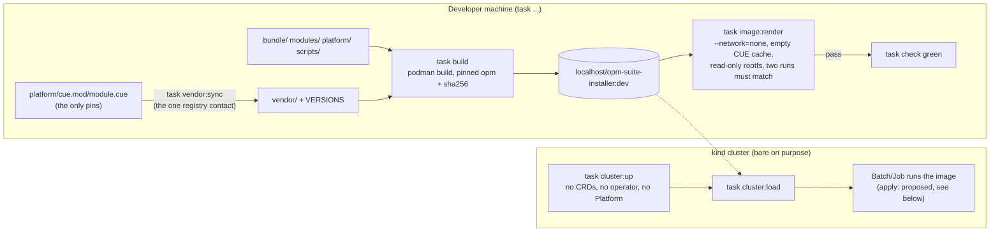
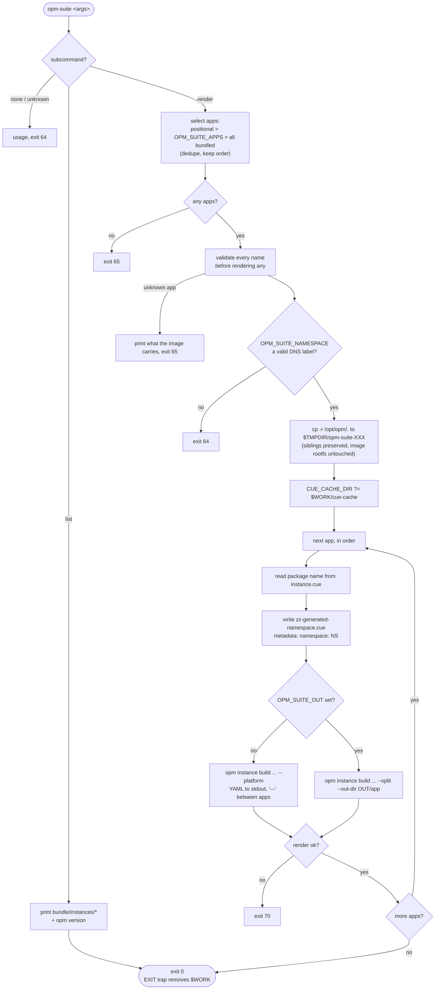
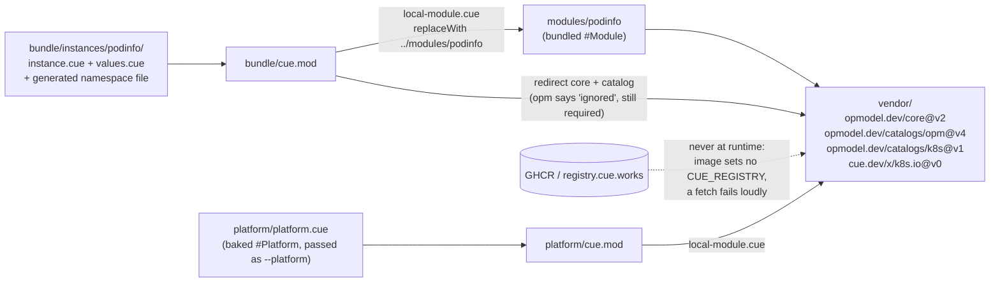
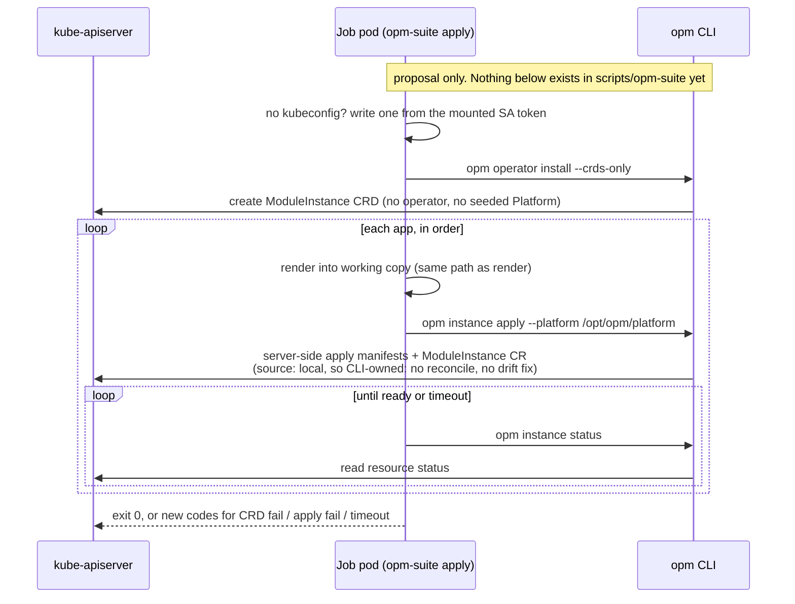

# opm-suite-installer

A proof of concept. One container image carries the `opm` CLI, a bash script and a set of
bundled OPM modules. Run it as a Kubernetes `Batch/Job` and it installs a whole suite of
applications into the cluster it runs in.

Milestone 1 is podinfo, installed from a bundled `#Module` through a `#ModuleInstance`.

## Status

The render half works. The image builds, carries podinfo, and renders it to a Deployment and a
Service with **no network and an empty CUE module cache** — verified in a container with
`--network=none`, a read-only root filesystem and no kubeconfig. `task image:render` re-runs that
proof on every `task check`.

Nothing is applied to a cluster yet. The `Batch/Job`, the ServiceAccount and the RBAC are the next
change.

## The idea

```
                container image
  ┌───────────────────────────────────────┐
  │  opm CLI                              │
  │  bash entrypoint  <- args + env       │      Batch/Job
  │  bundle/  (local OPM modules)         │  ─────────────────>  cluster
  │  platform/ (baked #Platform)          │
  └───────────────────────────────────────┘
```

The Job's arguments and environment select which bundled applications to install, into which
namespace, with which values. Today the script renders; applying is the next change.

```bash
task build                                   # build the image
podman run --rm --network=none $IMAGE list   # what does it carry?
podman run --rm --network=none $IMAGE render podinfo > manifests.yaml
```

| Variable | Meaning |
| --- | --- |
| `OPM_SUITE_APPS` | ordered, comma-separated; used when no application is named |
| `OPM_SUITE_NAMESPACE` | target namespace (default `default`) |
| `OPM_SUITE_OUT` | unset: one YAML stream on stdout. A directory: split files under `<dir>/<app>/` |

Exit codes: `0` success, `64` no or unknown subcommand, `65` an application the bundle does not
carry, `70` a render failed.

## Process flow

Four views of the same pipeline. The first three describe what exists today. The fourth is the
proposed `apply` path from the `apply-bundled-suite` OpenSpec change and is not implemented.

### Lifecycle: from pins to a checked image to a bare cluster



### Entrypoint control flow: `opm-suite render`



### Offline resolution: why `bundle/`, `modules/`, `platform/` and `vendor/` must be siblings



### Proposed: `opm-suite apply` as a Job

Not implemented. This is the shape the `apply-bundled-suite` change proposes.



## What this is testing

- Whether a suite of OPM applications can ship as **one** versioned artifact.
- Whether that artifact can install itself **offline**, with no registry reachable.
- What it costs: the RBAC surface, the loss of operator ownership, the platform pinning.

The honest counter-argument is written down in `CLAUDE.md` and tracked in `FINDINGS.md`: OPM
already publishes modules as OCI artifacts, so an installer image duplicates a distribution
channel that exists. This repo exists to find out whether the duplication buys anything.

## Requirements

Any Kubernetes cluster you can reach. For a disposable one:

```bash
task cluster:up      # bare single-node kind cluster
task cluster:status
task cluster:down
```

`cluster:up` deliberately stops at a stock Kubernetes cluster: no OPM operator, no CRDs, no
Platform. Installing those is the installer image's job, and it is part of what the experiment
is testing. A cluster that arrives pre-prepared proves nothing.

For a full local OPM demo with Flux and a local registry, see `opm-kind-demo`.

## Offline by construction, not by cache

`vendor/` holds the committed CUE source of `core`, both catalogs and `cue.dev/x/k8s.io`, and
`cue.mod/local-module.cue` redirects every dependency there. Nothing resolves from a registry, at
build time or at run time. An image that is offline only because someone's CUE cache happened to be
warm is not offline; the empty-cache assertion in `task image:render` is what tells the two apart.

`task vendor:sync` is the one thing in this repo that talks to a registry, and it is run by hand.
It refreshes `vendor/` from the published source of whatever `platform/cue.mod/module.cue` pins,
and records the exact versions in `vendor/VERSIONS`.

## Layout

| Path | What it is |
| --- | --- |
| `bundle/` | The bundle CUE module: one `instances/<app>/` directory per bundled application |
| `modules/` | The bundled OPM modules, each its own CUE module, reached by directory replacement |
| `platform/` | The baked `#Platform`, passed to every render as `--platform` |
| `vendor/` | Committed source of every CUE dependency, plus `VERSIONS` |
| `scripts/opm-suite` | The entrypoint |
| `hack/` | The kind cluster config and the `vendor:sync` / `image:render` scripts |
| `Containerfile` | The image: pinned `opm`, the entrypoint, and all of the above |
| `FINDINGS.md` | What the experiment taught us, negative results included |

The bundled modules sit on `suite-installer.invalid/...`, a path no registry serves, on purpose: a
successful offline render of a module that *could* have been fetched would prove nothing.
