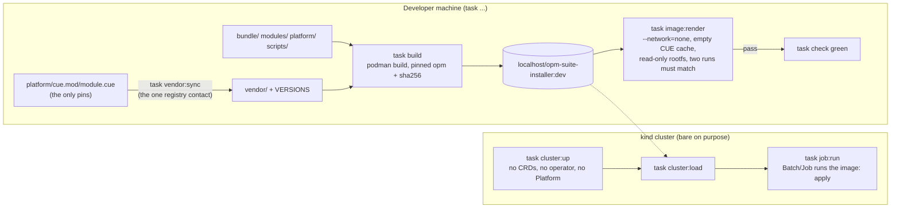
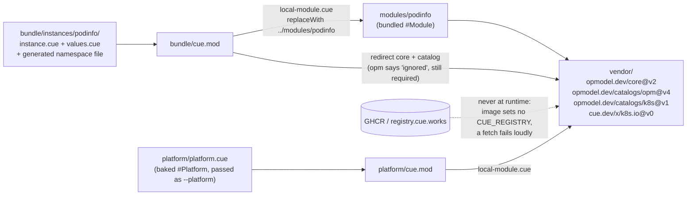

# opm-suite-installer

A proof of concept. One container image carries the `opm` CLI, a bash script and a set of
bundled OPM modules. Run it as a Kubernetes `Batch/Job` and it installs a whole suite of
applications into the cluster it runs in.

Milestone 1 is podinfo, installed from a bundled `#Module` through a `#ModuleInstance`.

## Status

Both halves work for one application. The image builds, carries podinfo, and renders it to a
Deployment and a Service with **no network and an empty CUE module cache** — verified in a
container with `--network=none`, a read-only root filesystem and no kubeconfig. `task image:render`
re-runs that proof on every `task check`.

Run as a `Batch/Job` on a **bare** kind cluster, the same image installs the OPM CRDs from the
manifest embedded in `opm`, applies podinfo through `opm instance apply` and waits until it is
ready, with a measured minimum of RBAC (`deploy/rbac.yaml`) and no operator. A second run changes
nothing and a hand-edited field is set back.

A newer image upgrades what an older one installed, and puts it back when the upgrade fails. The
image carries no history: it reads the values the cluster recorded, applies its own, and on a
failure re-applies what it read. Measured on a bare kind cluster, both directions — exit `74`
with podinfo back on its working tag after an upgrade to a tag that does not exist, exit `0` and
no pod restarted on the re-run of a good one.

## The idea

```
                container image
  ┌───────────────────────────────────────┐
  │  opm CLI                              │
  │  bash entrypoint  <- args + env       │      Batch/Job
  │  bundle/  (local OPM modules)         │  ─────────────────>  cluster
  │  platform/ (baked #Platform)          │
  └───────────────────────────────────────┘
```

The Job's arguments and environment select which bundled applications to install, into which
namespace, with which values.

```bash
task build                                   # build the image
podman run --rm --network=none $IMAGE list   # what does it carry?
podman run --rm --network=none $IMAGE render podinfo > manifests.yaml

task cluster:up && task cluster:load         # bare kind cluster, image loaded into it
task job:run                                 # apply deploy/, run the Job, print its log
task job:logs

# the same image from a host, against any cluster
podman run --rm -v ~/.kube/config:/kc:ro -e KUBECONFIG=/kc $IMAGE apply podinfo
```

| Variable | Meaning |
| --- | --- |
| `OPM_SUITE_APPS` | ordered, comma-separated; used when no application is named |
| `OPM_SUITE_NAMESPACE` | target namespace (default `default`); the Job passes its own |
| `OPM_SUITE_OUT` | render only. Unset: one YAML stream on stdout. A directory: split files under `<dir>/<app>/` |
| `OPM_SUITE_TIMEOUT` | apply only. Per-application readiness bound (default `300s`) |
| `OPM_KUBECONFIG` / `KUBECONFIG` | apply only. An explicit kubeconfig. With neither, inside a pod, one is written from the service account token |

Exit codes: `0` success, `64` no or unknown subcommand, `65` an application the bundle does not
carry, `70` a render failed, `71` the CRD bootstrap failed, `72` an apply failed, `73` an
application was applied but not ready in time, `74` an upgrade failed and the previous values
came back, `75` an upgrade failed and the revert failed too, `76` a `pre-apply` hook refused.

`apply` installs only the CRDs, never the operator: a bundled module is always CLI-owned (see
`FINDINGS.md`), so the Job applies and keeps ownership, and nothing reconciles after it exits.

`list` and the first line of every `apply` print the suite version, which is the image tag
`task build` was given. Nothing compares it against anything; it exists so a log says which
release did what.

## An upgrade is a values change

There is no `upgrade` verb. Between two suite releases a bundled application's `values.cue`
changes — an image tag, a replica count — and re-running `apply` with the newer image is the
upgrade. The module CUE is expected to stay put: `opm` records an instance's values on the
cluster, and a revert replays them, so values that no longer unify with a changed module make
their own revert fail (exit `75`, with the module named).

Before applying an application that is already installed, `apply` reads `spec.values` off its
`ModuleInstance` — the values the last apply consumed. If the new values fail to apply, or the
application is not ready within `OPM_SUITE_TIMEOUT`, the captured values go back on and the wait
runs again. The run stops there either way: `74` when the application came back, `75` when it did
not. A first install has nothing to revert to and still fails with `72`/`73`.

Readiness is **not** `opm instance status` alone. That command judges a Deployment by its
`Available` condition, which an upgrade to an unpullable image never clears, because the old pod
keeps serving — it reports `Ready` forever. So after `opm` agrees, each Deployment the instance
owns is checked for a finished rollout. See `FINDINGS.md` for which number actually catches it.

### Hooks

Two optional files per application, plain bash, neither needing an execute bit:

| File | When | On non-zero |
| --- | --- | --- |
| `bundle/instances/<app>/pre-apply` | before the apply | the run stops, exit `76`, nothing applied |
| `bundle/instances/<app>/on-failure` | after a failed upgrade, before the revert | logged, the revert happens anyway |

`on-failure` runs while the failed version is still installed, which is where a database restore
belongs: the revert then brings back a version that expects the restored state.

Both receive `OPM_SUITE_APP`, `OPM_SUITE_NAMESPACE`, `OPM_SUITE_KUBECONFIG` (the path `opm` is
using), `OPM_SUITE_WORK` (the working copy) and `OPM_SUITE_PREVIOUS_VALUES` — the path of a JSON
file holding the captured values, empty on a first install. Everything a hook prints goes to
stderr under the application's name; stdout belongs to `render`. `task lint` shellchecks them.
podinfo ships a `pre-apply` that prints the tag it is upgrading from and nothing else, so the
hook path is exercised on every run.

## Process flow

Four views of the same pipeline.

### Lifecycle: from pins to a checked image to a bare cluster



### Entrypoint control flow: `opm-suite render`


### Offline resolution: why `bundle/`, `modules/`, `platform/` and `vendor/` must be siblings



### `opm-suite apply` as a Job

```mermaid
sequenceDiagram
  participant K as kube-apiserver
  participant J as Job pod (opm-suite apply)
  participant O as opm CLI
  J->>J: select + validate apps, stage the working copy (same prelude as render)
  J->>J: no kubeconfig? write one from the mounted SA token (tokenFile)
  J->>O: opm operator install --crds-only
  O->>K: SSA the three embedded CRDs, wait Established<br/>(no operator, no seeded Platform); fail = exit 71
  loop each app, in order
    J->>K: GET moduleinstances/app<br/>404 = first install; spec.values = what a revert would restore
    J->>J: pre-apply hook, if present; non-zero = exit 76, nothing applied
    J->>O: opm instance apply instance.cue --platform (working copy)
    O->>K: server-side apply manifests + ModuleInstance CR<br/>(source: local, so CLI-owned: no reconcile after exit)
    loop every 5s until ready or OPM_SUITE_TIMEOUT
      J->>O: opm instance status app -n ns
      J->>K: GET each inventory Deployment<br/>observed>=generation, updated==desired,<br/>available==desired, total==updated
    end
    alt ready
      J->>J: on to the next app
    else failed, nothing captured
      J->>J: exit 72 (apply) or 73 (timeout), as before
    else failed, values captured
      J->>J: on-failure hook, if present (status logged, revert happens anyway)
      J->>O: opm instance apply, values.cue = the captured JSON
      J->>J: wait again: exit 74 if it came back, 75 if it did not
    end
  end
  J-->>K: exit 0
```

## What this is testing

- Whether a suite of OPM applications can ship as **one** versioned artifact.
- Whether that artifact can install itself **offline**, with no registry reachable.
- What it costs: the RBAC surface, the loss of operator ownership, the platform pinning.

The honest counter-argument is written down in `CLAUDE.md` and tracked in `FINDINGS.md`: OPM
already publishes modules as OCI artifacts, so an installer image duplicates a distribution
channel that exists. This repo exists to find out whether the duplication buys anything.

## Requirements

Any Kubernetes cluster you can reach. For a disposable one:

```bash
task cluster:up      # bare single-node kind cluster
task cluster:status
task cluster:down
```

`cluster:up` deliberately stops at a stock Kubernetes cluster: no OPM operator, no CRDs, no
Platform. Installing those is the installer image's job, and it is part of what the experiment
is testing. A cluster that arrives pre-prepared proves nothing.

For a full local OPM demo with Flux and a local registry, see `opm-kind-demo`.

## Offline by construction, not by cache

`vendor/` holds the committed CUE source of `core`, both catalogs and `cue.dev/x/k8s.io`, and
`cue.mod/local-module.cue` redirects every dependency there. Nothing resolves from a registry, at
build time or at run time. An image that is offline only because someone's CUE cache happened to be
warm is not offline; the empty-cache assertion in `task image:render` is what tells the two apart.

`task vendor:sync` is the one thing in this repo that talks to a registry, and it is run by hand.
It refreshes `vendor/` from the published source of whatever `platform/cue.mod/module.cue` pins,
and records the exact versions in `vendor/VERSIONS`.

## Layout

| Path | What it is |
| --- | --- |
| `bundle/` | The bundle CUE module: one `instances/<app>/` directory per bundled application |
| `modules/` | The bundled OPM modules, each its own CUE module, reached by directory replacement |
| `platform/` | The baked `#Platform`, passed to every render as `--platform` |
| `vendor/` | Committed source of every CUE dependency, plus `VERSIONS` |
| `scripts/opm-suite` | The entrypoint |
| `bundle/instances/<app>/pre-apply`, `on-failure` | The optional per-application hooks |
| `deploy/` | Namespace, ServiceAccount, the measured RBAC and the Job that runs the image |
| `hack/` | The kind cluster config and the `vendor:sync` / `image:render` scripts |
| `Containerfile` | The image: pinned `opm`, the entrypoint, and all of the above |
| `FINDINGS.md` | What the experiment taught us, negative results included |

The bundled modules sit on `suite-installer.invalid/...`, a path no registry serves, on purpose: a
successful offline render of a module that *could* have been fetched would prove nothing.
